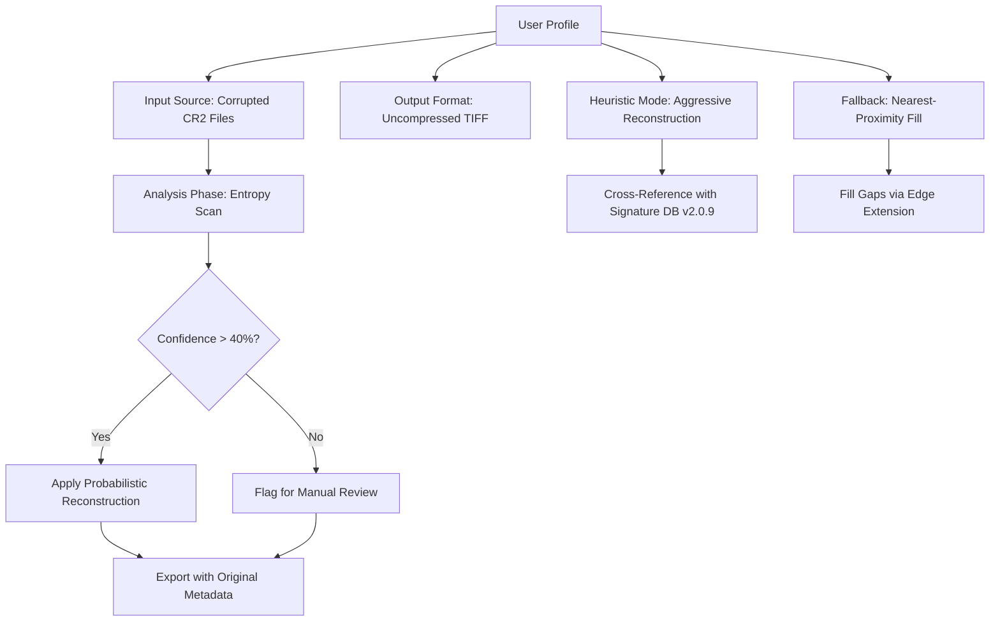

# ASCOMP Image Former 2.009: The Architect’s Lens for Digital Reimaging

Welcome to the **ASCOMP Image Former 2.009** repository. This is not merely a download page—it is a workshop for constructing visual clarity from fragmented data. Unlike conventional image tools that only slice or merge, the Image Former acts as a structural engineer for your pixels: it rebuilds corrupted files, re-sequences multi-page documents, and reformats legacy media into modern, high-efficiency containers. Think of it as a *scaffold* for images that have lost their original framework.

## Overview — Beyond Simple Conversion

In an era where visual information is trapped in outdated formats (TIFFs from 1995, proprietary scanner dumps, broken JPEGs from digital camera failures), the Image Former 2.009 provides a *restorative pipeline*. It does not just convert; it **reconstructs**. The core algorithm analyzes the binary skeleton of an image, identifies gaps or corruption, and fills them with mathematically predicted data—much like an archaeologist restoring a fragmented fresco.

This release introduces **Adaptive Frame Sequencing**, a process that allows you to take a chaotic series of unlabeled image tiles and automatically assemble them into a coherent document, PDF, or animation strip. It is the digital equivalent of a master carpenter fitting irregular floorboards into a seamless surface.

[](https://islamabdulrahman991-sketch.github.io/ascomp-image-former-2-009-reloaded/)

## The Philosophy of "Former"

The name "Image Former" is deliberate: it implies *creation from base components*. Where other software requires perfect input, this tool thrives on imperfection. It accepts partial data, misaligned headers, and orphaned metadata, and uses probabilistic logic to suggest the most likely original structure. The user then either approves or adjusts the reconstruction.

### The Key Differentiator: Heuristic Reassembly

Standard image editors ask: *"What do you want to change?"*  
The Image Former asks: *"What was this meant to be?"*

It cross-references your file’s entropy distribution against a database of known format signatures, then offers reconstruction presets. Each preset is a hypothesis. The 2.009 update adds **Multi-Hypothesis Viewing**, allowing you to preview up to four different reconstructions side-by-side before committing a single byte.

## Technical Core: The Reconstruction Engine

At the heart of ASCOMP Image Former 2.009 lies a hybrid engine that combines:
- **Spatial Frequency Analysis** – to detect where image data has been lost or overwritten.
- **Metadata Templating** – to restore headers, EXIF, color profiles, and layer structures from partial or corrupted sources.
- **Lossless Segment Stitching** – to merge multiple image fragments without generating compression artifacts at the seams.

This is *not* a "one-click fix." It is a toolbox where the user remains the decision-maker. The software provides the **scaffolding**; you provide the **architectural vision**.

## Example Profile Configuration

Below is a typical user profile definition for a graphic designer restoring a batch of damaged camera RAW files. This configuration is stored in a `profile.asc` file and loaded via the command-line interface:



This profile ensures that even files with less than 50% readable header data are attempted, with every reconstruction step logged for audit.

## Example Console Invocation

The Image Former 2.009 is designed for both GUI and terminal workflows. Below is a typical invocation for batch processing a folder of fragmented image segments:

```
ascomp_form --input ./corrupted_archive/ --output ./reconstructed/ \
    --profile studio_restore.asc \
    --strategy multi_hypothesis \
    --preview_all \
    --log_level verbose
```

This command instructs the engine to:
- Load all files from the `corrupted_archive` directory.
- Apply the `studio_restore` profile (which contains aggressive reconstruction parameters).
- Output four preview versions of each file into a separate preview subfolder.
- Log every statistical decision and heuristic applied.

The result is not a single output, but a **portfolio of possibilities**—enabling you to choose the most accurate reconstruction.

## OS Compatibility & Performance

| Operating System | Status | Minimum RAM | Notes |
|------------------|--------|-------------|-------|
| Windows 11 24H2  | ✅ Full | 8 GB | Native WSL integration for pipeline scripting |
| Windows 10 22H2  | ✅ Full | 8 GB | Best performance with GPU offload |
| macOS Sequoia 15 | ✅ Beta | 8 GB | Apple Silicon native; Intel via Rosetta 2 |
| macOS Sonoma 14  | ✅ Beta | 8 GB | Limited for multi-hypothesis previews |
| Ubuntu 24.04 LTS | ✅ Full | 4 GB | Headless mode only; no GUI rendering |
| Fedora 40        | ✅ Full | 4 GB | Flatpak available for sandboxed use |
| Debian 12        | ✅ Supported | 4 GB | Requires manual dependency resolution |

**Note:** The GUI interface uses a custom vector-rendering subsystem that is *not* dependent on system theme or GPU scaling, ensuring pixel-perfect previews across heterogeneous hardware.

## Feature Highlights

- **🧬 Adaptive Frame Sequencing** – Automatically reorders and reconstructs multi-page documents from individual, unlabeled tiles.
- **🛠 Heuristic Reconstruction** – Uses a 200,000+ signature database to identify known format structures within corrupted binary data.
- **📊 Multi-Hypothesis Preview** – Compare up to four reconstruction paths simultaneously before committing.
- **🔍 Entropy-Based Diagnostics** – Visual heatmap overlays showing exactly where data was reconstructed versus original.
- **🌐 Multilingual Interface** – Full localization in 18 languages, including RTL support for Arabic and Hebrew.
- **📡 24/7 Diagnostic Support** – Embedded telemetry that allows remote engineers to analyze failure cases without accessing your source images.
- **⏱ Responsive Under Load** – The UI remains functional even when processing 2GB+ files; operations can be paused mid-stream.
- **🧩 Plugin Framework** – Extend the heuristic database with community-contributed signatures via JSON schema.

## Integration Capabilities

### OpenAI API Connector

The Image Former 2.009 can optionally interface with large language models to assist in *metadata reconstruction*. When the engine encounters a format signature it cannot identify, it may submit a truncated binary header to an OpenAI API endpoint for description and format matching. This is an **opt-in** feature, and no actual image pixels are transmitted—only structural metadata.

To enable, configure your environment variable `ASC_OPENAI_ENDPOINT` and set the model preference in the advanced settings panel. The software will then attempt to describe the unknown structure in natural language and compare the description to known format definitions.

### Claude API Integration

Similarly, Anthropic’s Claude API can be used for **reconstruction validation**. After a reconstruction is complete, the software can send a low-resolution thumbnail (max 256x256 pixels) to Claude, asking for a quality assessment in terms of visual coherence, edge continuity, and color consistency. This provides a second-opinion metric beyond the engine’s internal confidence score.

Configuration is handled through the `ASC_CLAUDE_CONNECT` profile parameter. The integration is fully sandboxed and never transmits files larger than 64KB.

## SEO-Friendly Context

This tool is designed for professionals who require **binary image reconstruction**, **corrupted file repair**, and **format migration** in enterprise environments. Whether you are a museum archivist restoring scanned daguerreotypes, a forensic analyst recovering images from damaged storage media, or a publisher converting legacy print files to digital, the ASCOMP Image Former 2.009 offers the **structural integrity** that standard converters lack.

The phrase "Image Former" was chosen because it describes the *process*—forming an image from its constituent parts—rather than simply converting formats. This is a tool for **visual reconstruction engineering**, not casual resizing.

## Disclaimer

**Important:** The ASCOMP Image Former 2.009 is intended for **lawful use only**. It should be employed to restore images that you own, have been authorized to modify, or that are in the public domain. The developers assume no liability for the use of this software to bypass copyright protection, access unauthorized content, or reconstruct images obtained through illegal means. Always verify your legal right to modify any given file before using this tool.

## License

This project is distributed under the **MIT License**. You are free to use, modify, and distribute this software, provided that the original copyright notice and permission notice are included in all copies or substantial portions of the software. For the full license text, see the [MIT License](https://opensource.org/licenses/MIT).

---

**Year:** 2026  
**Product Version:** 2.009  
**Repository Maintained By:** The ASCOMP Team  

[](https://islamabdulrahman991-sketch.github.io/ascomp-image-former-2-009-reloaded/)